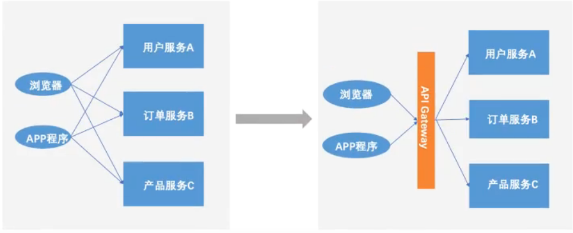
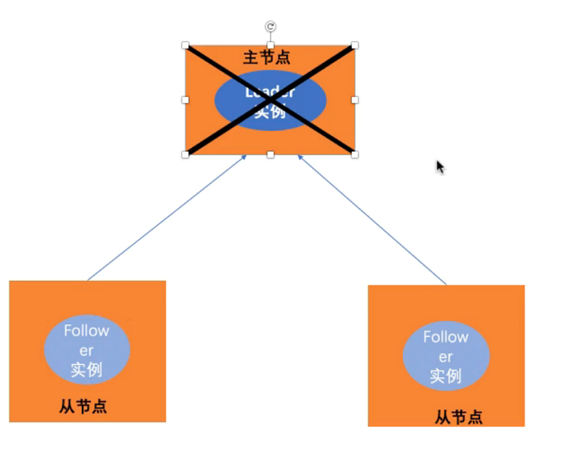

# go语言微服务
## 单体应用
### 单体应用架构


打包的时候所有的模块都会被打包到一个文件中
优点：
- 比较容易开发
- 容易运行和测试
- 容易部署上线

互联网公司架构图


但是，随着业务需求的增长，业务的变化，单体应用在慢慢发展和迭代后也会遇到一些问题，单体应用的瓶颈会逐步显现。并慢慢的走向单体地狱。
缺点：
- 局限性
随着系统业务的不断增长，代码量不断增加，我们创建维护的单体应用系统的性能和维护成本都会受到限制，限制了我们继续新增业务的能力
- 敏捷开发受挫
- 持续部署受挫
- 应用难以扩展
- 可靠性低
所有模块相互依存
- 技术升级困难
拆解、重构单体应用异常困难
## 微服务
一个服务通常实现一组不同的特性或功能，例如订单管理、客户管理等。每一个微服务都是一个小型迷你应用，在需要依赖的地方，通过REST API连接其他所需要的服务
### 微服务架构

### 微服务与数据库的关系
由原本统一的数据库转换成有几个微服务就应该对应几个数据库，松耦合
### 负载均衡


负载均衡设计应尽量保持均衡
### 伸缩立方

- X轴：运行多个负载均衡后的多个实例
- Y轴：对应用进一步分解为微服务（分库）
- Z轴：大数据量时，对数据进行分区（分表）
### 性能扩展
- 优点
  - 解决复杂问题
  - 团队分工协作更容易
  - 独立部署
  - 程序扩展能力强
- 缺点
  - 规模难以界定
  - 增加系统复杂度
  - 分区数据库架构难题
  - 项目测试难度增加
  - 多服务修改更加困难
  - 增加部署运维复杂度

## 微服务定义
微服务之父Martin先生给微服务的定义：将一个单体应用拆分成一组微小的服务组件、每个微小服务组件运行在自己的进程上，组件之间通过如RESTFUL API这样的轻量级通信进制进行交互，这些服务以业务能力为核心，用自动部署机制独立部署，另外，这些服务可以用不同的语言进行研发，用不同技术来存储数据。
- 在分布式环境中，将单体应用拆分为一系列服务，共同组成整个系统
- 每个服务都轻量级，单独部署，运行在自己的进程中
- 每个微服务注重自己核心能力的开发，微服务组件之间采用轻量级的通信方式进行通信，包括但不限于RESTFUL API、RPC等
- 按照业务边界进行划分
- 微服务是一种编程架构思想，有不同语言实现

## 微服务实践需要解决的问题
### 存在的问题：
- 1、客户端如何访问这些服务？
- 2、每个服务之间如何进行通信？
- 3、多个微服务如何实现？
- 4、如果服务出现宕机，该如何解决？

VisualDesigner

### 解决方案：
- 1、增加网关（API Gateway）
  - 提供统一的服务入口，让微服务对前台透明
  - 聚合后台服务，节省流量，提升性能
  - 提供安全，过滤，流控等API管理功能
  
  
- 2、进程间通信（Inter Process Communication）IPC
  - 同步调用
  同步调用有两种实现方式：分别是REST和RPC
    - REST：REST基于http，实现更容易，各种语言都支持，同时能够跨客户端，对客户端没有特殊的要求，只要具备HTTP的网络请求库功能就能实现
    - RPC：RPC的特点是传输效率高，安全可控，在系统内部调用实现时使用的较多
   - 异步消息调用
   异步消息的方式在分布式系统中有特别广泛的应用，它既能减低调用之间的耦合度，又能成为调用之间的缓冲，确保消息积压不会冲垮调用方。常见的异步消息调用框架有：Kafka、Notify、MessageQueue
   
   
- 3、服务管理器
  在微服务架构中，一般每一个微服务都有多个拷贝，来做负载均衡。一个服务随时可能下线，也可能应对临时访问压力增加新的服务节点。这会导致出现新的问题，服务之间如何相互感知？服务如何进行管理？
  - 解决多服务之间的识别，发现问题一般通过注册的方式来实现。
  当服务上线时
    - 服务提供者将自己的服务注册信息注册到某个专门的框架中，并通过心跳维持长连接，实时更新链接信息。
    - 服务调用者通过服务管理框架进行寻址，根据特定的算法，找到对应的服务，或者将服务注册信息缓存到本地。
   - 当服务下线时，服务管理框架会发送服务下线的通知给其它服务。
   - 常见的服务管理框架有：Zookeeper等框架
  - 两种具体的实现：基于客户端的服务注册于发现、基于服务端的服务注册与发现
    - 基于客户端的服务注册于发现
      - 架构简单，扩展灵活，只对服务注册器依赖。缺点是客户端要维护所有调用服务的地址，有技术难度，一般大公司都有成熟的内部框架支持。
    
   
    - 基于服务端的服务注册于发现
       - 优点是简单，所有服务对于前台调用是透明的，一般小公司在云服务上部署的应用采用的比较多。
       

- 4、服务宕机等异常处理
高可用系统的保障措施
当我们的系统由一系列的服务调用链组成的时候，我们必须确保任一环节出问题都不至于影响整体链路。相应的手段有很多，比如说：
  - 重试机制
  - 限流
  - 熔断机制
  - 负载均衡
  - 降级（本地缓存）
  
## 微服务管理
回顾四个问题
- 1、客户端如何访问这些服务？
- 2、每个服务之间如何进行通信？
- 3、多个微服务如何实现？
- 4、如果服务出现宕机，该如何解决？   
### 分布式和单点故障
#### 主从模式分布式系统


#### 单点故障



### consul
consul是gooogle开源的额使用go语言开发的服务发现、配置管理中心服务，consul属于微服务架构的基础设施中用于发现和配置服务的一个工具。属于服务端发现。consul提供如下几个核心功能：
- 服务发现
consul的某些客户端可以提供一个服务，其他客户端可以使用consul去发现这个服务的提供者
- 健康检查
consul客户端可以提供一些健康检查，这鞋健康检查可以关联到一个指定的服务，比如心跳包的检测。
- 键值存储
应用实例可以使用consul提供的分层键值存储，比如动态配置，特征标记，协作等。通过HTTP API的方式进行获取
- 多数据中心
#### consul中的Raft
Raft是一种基于Paxos的一致性算法
Raft中的节点总是处于以下三种状态之一：follower、candidate或leader

#### consul内部原理


#### 实践
安装
```bash
$ sudo docker pull consul
```
运行
```bash
$ sudo docker run --name=cs -p 8500:8500 consual agent -server -bootstrap -ui -client 0.0.0.0
# 8500是ui后台
# http://localhost:8500
```
## 梳理业务逻辑


## 书籍
微服务：从设计到部署

## go-micro微服务开发库


Micro API
- API
将http请求映射到API接口
- RPC
将http请求映射到RPC服务
- event
将http请求广播到订阅者
- proxy
反向代理
- web
支持websocket的反向代理


## go-kit
http://www.jtthink.com/course/83